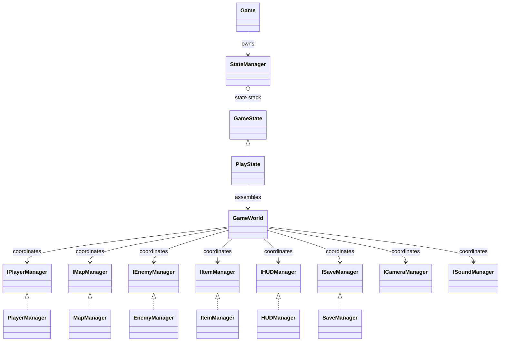
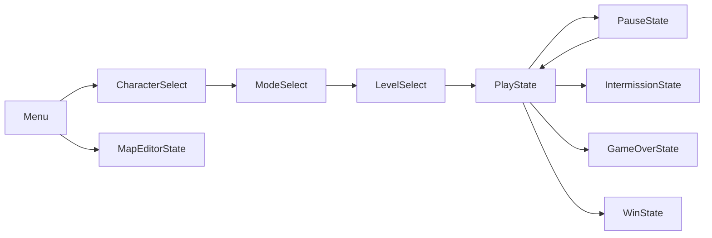
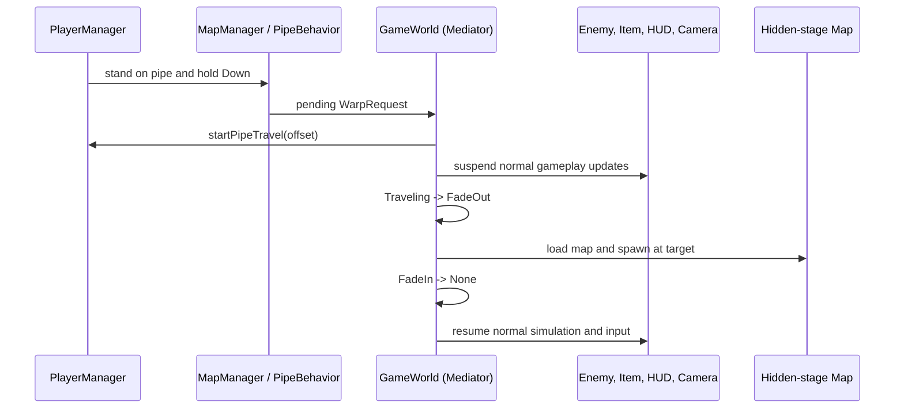
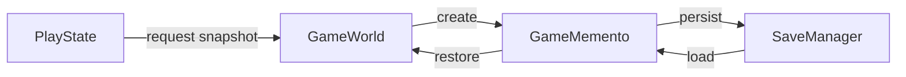
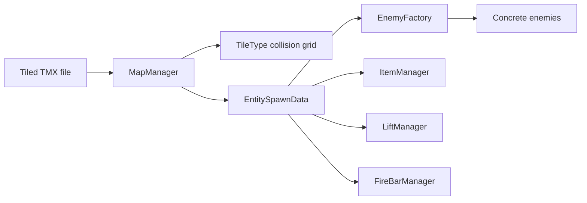
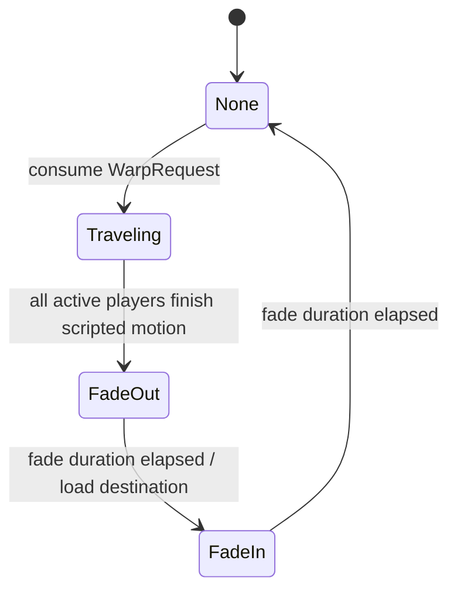

# SUPER MARIO BROS.

## Object-Oriented Programming Project Report

**University of Science - Faculty of Information Technology**  
**Course:** Object-Oriented Programming - CS202  
**Class - Group:** 25A01 - Group 1  
**Academic year:** 2026  

### Group members

| Student | Student ID |
|---|---:|
| Nguyen Le Tran | 25125039 |
| Le Quang Nguyen Phuc | 25125070 |
| Le Quynh Anh | 25125071 |
| Dinh Nguyen Hong Anh | 25125078 |

---

## Abstract

This report presents the architecture, implementation, and evaluation of a C++ recreation of *Super Mario Bros.* developed with SFML for the CS202 Object-Oriented Programming course. The project is a complete playable application rather than a collection of isolated exercises. It combines a state-driven user interface, tile-based levels, multiple playable characters, enemies and items, collision and physics, local multiplayer, sound, persistence, a map editor, and a hidden stage reached through an animated pipe transition.

The architecture emphasizes separation of concerns and interface-based collaboration. `Game` owns the main loop, `StateManager` controls the application states, `PlayState` assembles gameplay dependencies, and `GameWorld` coordinates the runtime managers as a Mediator. The implementation applies the State, Mediator, Memento, Factory, Strategy, Command, and Observer-style event propagation patterns to concrete design problems. This report explains why those patterns were selected, identifies their participants in the codebase, and evaluates the trade-offs of each decision. It also documents the player-to-pipe transition, the scrolling cloud scenery, the correction of a terrain-overdraw artifact, the testing process, and the team's integration workflow.

**Keywords:** C++, SFML, object-oriented programming, game architecture, design patterns, tile map, state machine, Mediator, Memento.

## Table of Contents

1. Introduction  
2. Requirements and Project Scope  
3. Team Composition and Integration  
4. System Architecture  
5. Object-Oriented Design  
6. Applied Design Patterns  
7. Core Gameplay Implementation  
8. Level, Enemy, Item, and Map Systems  
9. User Interface, Persistence, and Supporting Systems  
10. Feature Case Study: Animated Pipe Transition  
11. Feature Case Study: Background Scenery  
12. Testing and Verification  
13. Technical Challenges and Solutions  
14. Evaluation and Future Improvements  
15. Conclusion  
16. References  

---

# 1. Introduction

## 1.1 Background

Real-time games are useful object-oriented programming case studies because many independent objects must cooperate under strict timing constraints. A platform game contains input, movement, animation, collision, map data, enemies, items, audio, cameras, user interfaces, and persistent progress. If these responsibilities are placed in one class, the program quickly becomes difficult to reason about and dangerous to modify. The design therefore needs both a clear ownership model and carefully controlled communication between subsystems.

The group selected *Super Mario Bros.* because its mechanics are familiar while still requiring a broad range of technical solutions. The recreation includes Mario and Luigi, gravity and variable jumping, terrain and entity collision, enemies, power-ups, coins, scoring, lives, stage progression, a HUD, menus, sound, save/load, and map editing. Three principal stages are available through a locked progression interface, and an additional hidden area is entered through a pipe.

## 1.2 Project objectives

The project has five principal objectives:

1. Build a complete and playable C++/SFML application with a stable game loop.
2. Demonstrate encapsulation, inheritance, abstraction, polymorphism, and responsible resource ownership.
3. Apply design patterns only where they solve identifiable design problems.
4. Support team development through modular ownership, shared interfaces, and controlled integration.
5. Produce a system that is extensible enough to add screens, entities, blocks, and levels without redesigning the whole application.

## 1.3 Scope

The delivered system covers the complete flow from starting the application to selecting a character and mode, choosing an available stage, playing, pausing, saving, losing, winning, and returning to menu states. Gameplay includes single-player and local two-player configurations, animated characters, tile collision, block interactions, enemies, collectable items, moving lifts, fire bars, a flagpole sequence, and stage completion. The project uses Tiled TMX maps and also supplies an in-game map editor.

Online multiplayer, network synchronization, a general scripting engine, and a full commercial content pipeline are outside the course scope. The architecture nevertheless isolates the important seams so that future implementations could replace or extend selected modules.

# 2. Requirements and Project Scope

## 2.1 Functional requirements

| Area | Required behavior | Implementation evidence |
|---|---|---|
| Application flow | Menu, selection, play, pause, win, game-over, leaderboard, and editor screens | `GameState` hierarchy and `StateManager` |
| Character control | Mario/Luigi movement, running, variable jump, shooting, gravity | `PlayerManager`, character classes, input commands |
| Collision | Ground, block, enemy, item, lift, hazard, and flag interactions | Player/map/enemy/item managers and block behavior strategies |
| Levels | Three main levels plus a hidden area | `LevelManager`, TMX maps, warp data |
| Entities | Goomba, Koopa and additional enemy/item types | `EnemyFactory`, `EnemyManager`, `ItemManager` |
| Interface | HUD, score, coins, lives, world, timer, menu feedback | `HUDManager` and concrete UI states |
| Persistence | Save and resume relevant progress | `GameMemento`, `ISaveManager`, `SaveManager` |
| Tools | Create and edit maps | `MapEditorState` |
| Progression | Lock unopened stages and present selectable level cards | `LevelSelectState` |
| Hidden-stage transition | Move the player through a pipe before changing map | `GameWorld::beginPipeTransition` and transition phases |
| Scenery | Add drifting clouds while retaining terrain bushes/grass | `GameWorld::renderScenery` and map tile layer |

## 2.2 Non-functional requirements

The main non-functional goals were maintainability, stability, testability, and responsiveness. Managers expose narrow interfaces where practical. Dynamic entities use RAII ownership, mainly through `std::unique_ptr` and `std::shared_ptr`. State transitions are deferred until the active callback has returned, avoiding self-destruction during event handling. Factory texture preloading avoids avoidable frame hitches. The pipe cutscene suppresses normal input and simulation updates so the map cannot change in the middle of unrelated collisions.

The program must remain interactive at real-time frame rates. Each frame therefore follows a predictable order, and work that depends on final player positions is performed after the movement and collision phase. Rendering distinguishes world coordinates from the default HUD view so that the user interface does not move with the camera.

## 2.3 Acceptance criteria

A build is considered acceptable when it starts from the integrated branch, shows the complete interface flow, loads each unlocked stage, supports the selected character and mode, resolves common collisions without instability, creates enemies and items from map data, saves and loads a valid snapshot, and permits a complete pipe-entry and pipe-exit cycle. Visual acceptance additionally requires that the player visibly enters the pipe, the screen fades without exposing a half-loaded map, and cloud scenery never overwrites solid terrain.

# 3. Team Composition and Integration

## 3.1 Responsibilities

| Member | Role | Responsibilities and deliverables |
|---|---|---|
| **Le Quynh Anh** (25125071) | Lead, Architecture, Integration | **Architecture:** GitHub/SFML setup, conventions, class design. **Core flow:** `Game`, `StateManager`, `PlayState`. **Pattern:** `GameWorld` Mediator. **Integration:** `Testing` branch, pipe transition, scenery. |
| **Nguyen Le Tran** (25125039) | Gameplay, Player, Collision | **Player:** movement, gravity, jump, controls. **Collision:** terrain, blocks, enemies, items. **Characters:** Mario/Luigi and local multiplayer. **Support:** player feedback and map editor. |
| **Dinh Nguyen Hong Anh** (25125078) | Level, Entity, Factory, Sound | **Levels:** TMX loading and three main stages. **Enemies:** Goomba, Koopa, hazards, lifecycle. **Items:** coins and power-ups. **Pattern/support:** `EnemyFactory` and sound. |
| **Le Quang Nguyen Phuc** (25125070) | UI, Persistence, Progression | **Interface:** HUD and main menu flow. **States:** pause, game-over, winning flow. **Persistence:** Memento save/load. **Progression:** locked card-based level selection. |

## 3.2 Integration method

Subsystem ownership reduced accidental overlap, but integration still required shared contracts. The group used member-owned feature branches and the shared `Testing` integration branch. Changes that affected widely used headers or data structures were kept small and reviewed before merge. Interface dependencies were preferred over direct concrete dependencies, allowing work on the player, map, enemy, item, UI, and save systems to proceed with fewer conflicts.

| Integration stage | Branch activity | Quality gate |
|---|---|---|
| 1. Feature | Implement in a member-owned branch | Focused local build and subsystem check |
| 2. Review | Compare with the latest `Testing` branch | Inspect shared-file diffs and dependencies |
| 3. Integrate | Merge into `Testing` | Resolve conflicts without replacing unrelated work |
| 4. Validate | Treat `Testing` as the common baseline | Build, launch, and run focused smoke checks |

Integration was performed in layers. The application and state flow were stabilized first. Gameplay managers were then connected through `PlayState` and `GameWorld`. Content systems were added through map data rather than hard-coded level-specific branches. UI and persistence were integrated after runtime data ownership was clear. Finally, the hidden-stage pipe sequence and background scenery were inserted into the established update and render order.

## 3.3 Coding conventions

The project uses PascalCase for types, camelCase for functions and local variables, and the `m_` prefix for member fields. Headers expose contracts and ownership, while implementation details remain in source files. Interface classes use an initial `I`, for example `IMapManager`, `IPlayerManager`, and `ISaveManager`. Scoped enumerations represent modes and transition phases. Resource ownership is expressed with standard smart pointers, and null checks protect optional subsystems.

Comments are used to record decisions, update order, and non-obvious invariants. For example, the pipe transition code explains why gameplay systems are frozen, and the scenery code records why bushes must remain in the map layer. These comments preserve design knowledge that is more valuable than a line-by-line restatement of syntax.

# 4. System Architecture

## 4.1 Architectural overview

The system uses a layered, manager-oriented architecture. The application layer owns the window and state stack. The state layer contains screens with separate input, update, and render behavior. The gameplay layer is assembled inside `PlayState`. `GameWorld` is the central coordinator for gameplay managers, while the managers own entities and specialize in one responsibility. The data layer consists of TMX maps, spawn records, save snapshots, configuration, and assets.

## 4.2 Application state flow

`Game` delegates the active screen to `StateManager`. A stack allows `PauseState` to overlay `PlayState` without destroying gameplay. Requested transitions are queued as `Change`, `Push`, or `Pop` operations and applied after input/update callbacks. This protects against invalidating the current state while one of its own methods is still running.

## 4.3 Dependency assembly

`PlayState` is the composition root for a gameplay session. It creates concrete managers, connects their interface dependencies, sets the selected character/mode/stage configuration, and then initializes `GameWorld`. This keeps construction details out of individual entities. It also makes the dependency direction visible: the high-level flow knows concrete implementations during assembly, while runtime coordination operates through interfaces.

The `GameWorld` interface boundary is particularly important. A player does not need direct ownership of the HUD, map, enemy list, and camera. Instead, the mediator reads or forwards the information required by each phase. The arrangement reduces circular includes and allows managers to be replaced more safely.

## 4.4 Update and render order

The gameplay update is intentionally ordered:

1. Update map animations and scenery timing.
2. Advance moving lifts so their frame displacement is known.
3. Update players and resolve terrain/lift movement.
4. Consume any pending map warp and begin the pipe cutscene.
5. Check flagpole and stage events.
6. Update enemies and then items using current player positions.
7. Evaluate timer, hazards, death, lives, and respawn.
8. Synchronize HUD values and update camera tracking.

Rendering uses the camera view for the map, scenery, lifts, hazards, enemies, items, and players. It then restores the default view for HUD elements and the full-screen fade overlay. This separation prevents the HUD from scrolling with the stage.

# 5. Object-Oriented Design

## 5.1 Encapsulation

Managers hide collections, timers, transition phases, and resource details behind focused operations. For example, external code does not modify the pipe transition fields directly. It calls the relevant behavior, after which `GameWorld` owns the phase, timer, destination map, and destination coordinates. `SaveManager` is given a snapshot instead of reaching into each manager's private fields.

Encapsulation is also visible in map interactions. Block behaviors receive an `IMapContext`, a deliberately narrower surface than the full concrete `MapManager`. A behavior can request a tile replacement, spawn an item, play feedback, or queue a warp without being allowed to manipulate every internal map structure.

## 5.2 Abstraction and dependency inversion

Interfaces such as `IPlayerManager`, `IMapManager`, `IEnemyManager`, `IHUDManager`, and `ISaveManager` define what the mediator needs rather than how each subsystem works. High-level policies depend on these abstractions. `EnemyManager` similarly accepts an `IEnemyFactory`, allowing a different factory implementation to be injected for testing or extension.

The abstraction boundaries are not decorative. They contain compile-time dependencies and make responsibilities understandable. `IEnemyFactory::createEnemy` returns an `std::unique_ptr<Enemy>` from typed `EntitySpawnData`; the caller does not need to know which concrete constructor or texture path was selected.

## 5.3 Inheritance and polymorphism

The state hierarchy is a clear example of runtime polymorphism: each concrete state supplies the same input/update/render contract. Enemy classes share an `Enemy` base and implement type-specific behavior. Player characters share common movement and collision mechanisms while Mario and Luigi remain selectable identities. `IBlockBehavior` provides another polymorphic family for solid, background, pipe, brick, question, hidden, death-zone, flagpole, coin, and hazard tiles.

Polymorphism removes repeated type checks from high-level loops. `StateManager` calls the active state's virtual operations. `EnemyManager` updates enemies through base pointers. `MapManager` dispatches tile-specific effects through the behavior interface.

## 5.4 Composition and ownership

Composition is favored for large subsystems. `Game` contains a `StateManager`; `PlayState` owns a `GameWorld`; `GameWorld` references manager interfaces; managers own their live entities. Smart pointers express whether ownership is exclusive or shared. An enemy created by `EnemyFactory` is returned as `std::unique_ptr<Enemy>`, transferring clear ownership to the manager.

This structure improves destruction safety. When a state is replaced or a session ends, owned objects are released through RAII. The design avoids global mutable entity containers and minimizes manual `new`/`delete` management.

## 5.5 SOLID evaluation

- **Single Responsibility:** states manage screen behavior; factories create entities; managers manage lifecycles; the save manager persists snapshots.
- **Open/Closed:** new states, enemy subclasses, block strategies, and commands can be added behind existing abstractions.
- **Liskov Substitution:** concrete states, managers, enemies, and behaviors are used through their base contracts.
- **Interface Segregation:** specialized interfaces expose the capabilities needed by collaborators rather than one universal manager API.
- **Dependency Inversion:** `GameWorld`, `EnemyManager`, and block behaviors depend on interfaces such as `IEnemyFactory` and `IMapContext`.

# 6. Applied Design Patterns

## 6.1 State Pattern

**Problem.** Menu, selection, gameplay, pause, editor, game-over, and winning screens have fundamentally different rules. Placing those rules in one `Game` class would produce a large conditional and tightly coupled transitions.

**Participants.** `GameState` is the State abstraction. `MenuState`, `CharacterSelectState`, `ModeSelectState`, `LevelSelectState`, `PlayState`, `PauseState`, `IntermissionState`, `GameOverState`, `WinState`, `LeaderboardState`, `InitialsEntryState`, and `MapEditorState` are concrete states. `StateManager` is the context.

**Consequences.** Each screen can evolve independently and can allocate only the resources it needs. The state stack naturally models pause overlays. Deferred transitions make self-replacement safe. The cost is a larger number of classes and the need to pass shared configuration between states.

## 6.2 Mediator Pattern

**Problem.** Player, map, enemies, items, HUD, camera, sound, lifts, fire bars, level progression, and persistence must collaborate. Direct many-to-many references would create circular dependencies and make update order implicit.

**Participants.** `GameWorld` is the Mediator. The collaborating components are the manager interfaces and their concrete implementations. `PlayState` constructs and registers the colleagues.

**Consequences.** Cross-system rules are visible in one update sequence, and individual managers remain more focused. The main trade-off is that `GameWorld` can become large. The team mitigates this by delegating specialized work and exposing narrow manager interfaces rather than moving all logic into the mediator.

## 6.3 Memento Pattern

**Problem.** Saving requires a consistent snapshot of stage, lives, player scores, coins, character/mode configuration, and a custom map path. Persistence code should not be coupled to all internal runtime objects.

**Participants.** `GameWorld` is the Originator through `createMemento` and `restoreFromMemento`. `GameMemento` and `PlayerStateMemento` are snapshot objects. `SaveManager`, accessed through `ISaveManager`, acts as the Caretaker. `PlayState` coordinates load and resume flow.

**Consequences.** Save format and runtime ownership remain separated. Multiplayer is supported by a vector of player snapshots. Snapshot schema changes must be versioned carefully in future releases because old save files may not contain new fields.

## 6.4 Factory Pattern

**Problem.** A map supplies entity type and spawn data, but the map loader should not know concrete constructors, texture preparation, or enemy-specific callbacks.

**Participants.** `IEnemyFactory` defines `preloadTextures` and `createEnemy`. `EnemyFactory` maps typed `EntitySpawnData` to concrete `Enemy` subclasses. `EnemyManager` owns the created objects and depends on the factory abstraction.

**Consequences.** Creation policy is centralized, constructors do not leak into the lifecycle manager, and factories can be replaced in tests. Adding a type still requires factory registration, but the modification is localized rather than scattered across map and gameplay code.

## 6.5 Strategy Pattern

**Problem.** Tile types have different solidity and reactions. A pipe entrance reacts to standing and Down input, a pipe exit reacts to side contact, a question block spawns content, a hidden block behaves differently by collision direction, and a death zone kills the player.

**Participants.** `IBlockBehavior` is the Strategy. Concrete strategies include `PipeBehavior`, `QuestionCoinBehavior`, `QuestionPowerupBehavior`, `HiddenBlockBehavior`, `DeathZoneBehavior`, `FlagpoleBehavior`, and others. `MapManager` is the context, while `IMapContext` limits what strategies can mutate.

**Consequences.** Block-specific rules are separated from general map traversal. Direction-specific collision methods make intent explicit. The behavior registry is an additional configuration point, but it replaces repeated switch statements in collision code.

## 6.6 Command Pattern

**Problem.** Keyboard events and continuous key state should be translated into player intentions without embedding character movement calls throughout SFML event handling.

**Participants.** `Command` declares `execute(PlayerManager&)`. `JumpCommand`, `StopJumpCommand`, `MoveLeftCommand`, `MoveRightCommand`, `StopHorizontalCommand`, and `ShootCommand` implement actions. `PlayerInputHandler` is the Invoker and returns reusable command objects according to `KeyBinding`. `PlayerManager` is the Receiver.

**Consequences.** Input mapping is isolated from action execution. The same player behavior can be triggered by different bindings, and command objects can later support replay or AI control. Reusing pre-created commands avoids per-frame allocation. The current commands are intentionally lightweight and do not yet implement undo.

## 6.7 Observer-style event propagation

**Problem.** Gameplay events must update career statistics and achievements without making player, enemy, or map classes responsible for persistence.

**Implementation.** `PlayState` registers focused callbacks on `PlayerManager`, `EnemyManager`, and `MapManager`. The callbacks obtain the shared `ISaveManager` through `GameWorld` and call `recordStat(...)` for events such as coin collection, power-up collection, enemy kills, and broken blocks. `GameWorld` also records world-level results such as deaths, wins, co-op stage clears, and the Stage 1 speedrun condition. `SaveManager` stores these counters and evaluates the requirements in `AchievementDefs.h`. Newly unlocked achievement IDs are queued by `SaveManager`; `GameWorld` drains the queue and asks `IHUDManager` to display the corresponding toast.

**Evaluation.** This is a simplified Observer implementation based on one callback for each event category rather than a reusable multi-subscriber event bus. It keeps achievement rules and persistence out of gameplay classes, but adding more subscribers would require a more general event interface.

## 6.8 Pattern interaction

The patterns cooperate rather than exist as isolated examples. A `PlayState` (State) assembles `GameWorld` (Mediator). A `PipeBehavior` (Strategy) queues a warp that the mediator executes. Player input arrives through `Command` objects. Enemy data is converted by `EnemyFactory`. The session is captured as a `GameMemento`. Gameplay callbacks send career statistics to `SaveManager`, which evaluates achievements and returns unlock notifications to `GameWorld`. This interaction is the main architectural value: each pattern controls one source of change.

# 7. Core Gameplay Implementation

## 7.1 Main loop and time step

The application processes SFML events, updates the active state with elapsed time, and renders the state. Delta time is passed to animation, movement, camera, scenery, and transition logic so behavior does not depend directly on the frame rate. State-level delegation means the menu does not update gameplay resources, while `PlayState` forwards runtime work to `GameWorld`.

## 7.2 Player input and movement

`PlayerInputHandler` supports configurable `KeyBinding` values for the first and optional second character. Discrete events generate commands such as jump, stop-jump, and shoot. Real-time polling selects move-left, move-right, or stop-horizontal commands. Run and Down states are queried where continuous behavior is needed.

The player update combines horizontal acceleration/speed, gravity, jump control, collision correction, and animation state. Variable jump behavior depends on both the initial jump action and whether the jump key remains held. Movement commands do not manipulate SFML events or global state; they act on the player receiver.

## 7.3 Collision responsibilities

Collision is divided by domain. Tile collision uses the map's grid and behavior strategies. Enemy collision is handled by the enemy subsystem with current player positions. Item collision is handled after player movement so collection tests use final frame coordinates. Lifts update before players to provide correct platform displacement. Fire bars and death zones are treated as hazards. This ordering avoids one-frame inconsistencies in grounded state, animation, and pickups.

## 7.4 Multiple characters and local multiplayer

The world can own one or two player managers. Shared lives are managed at the world level, while each player retains relevant score and coin state. The death rule distinguishes one-player and two-player sessions: a one-player round ends when the single player dies; a two-player round ends when both players are dead. Save snapshots use a vector of player records, allowing the persistence model to support either configuration.

## 7.5 Stage completion and failure

Flagpole collision begins a controlled completion sequence rather than instantly destroying the current state. Timer bonus, score feedback, and level progression can complete before transition. Death reduces shared lives and either reloads the current level or marks game over. These decisions are coordinated by `GameWorld`, while the visible screen transition is performed by the surrounding state system.

# 8. Level, Enemy, Item, and Map Systems

## 8.1 TMX map pipeline

Maps are authored as Tiled TMX data. `MapManager` converts tile layers into runtime tile information and reads object layers into typed spawn records. The map therefore describes where objects appear, while code determines how each type behaves.

## 8.2 Blocks and map interactions

`MapManager` asks the registered `IBlockBehavior` whether a tile is solid and dispatches directional contacts. `onHitFromBelow` supports question, power-up, multi-coin, hidden, and brick interactions. `onStandingOn` supports pipe entrances. `onSideTouch` supports the hidden-room pipe exit. Strategies use `IMapContext` to change tile state or request side effects while the map remains responsible for keeping runtime and raw tile data synchronized.

## 8.3 Enemy creation and lifecycle

`EnemyFactory` preloads textures and creates an appropriate subclass from `EntitySpawnData`. `EnemyManager` owns the returned `unique_ptr` objects, updates active enemies, resolves relevant interactions, and removes expired objects safely. A fireball-spawn callback supports enemies that generate projectiles without exposing those details to the map loader.

The factory interface provides a test seam: a controlled factory can return known enemy doubles or reject invalid type strings. It also follows dependency inversion because `EnemyManager` accepts `IEnemyFactory` rather than constructing every concrete enemy itself.

## 8.4 Items and power-ups

Coins, mushrooms, fire flowers, stars, and block-spawned rewards are handled by the item and map behavior systems. Collection changes player state and supplies score/HUD feedback. Block behavior directly associates the reward with the player who triggered it, preventing the wrong player from receiving a multiplayer coin reward.

## 8.5 Level progression and hidden maps

`LevelManager` tracks the current principal stage. The level selection screen presents stages as cards and prevents entry into unopened stages. Hidden rooms are treated as destination maps associated with a warp rather than as additional selectable principal levels. This distinction allows the player to enter and exit a hidden area while preserving stage progression and the surrounding state.

# 9. User Interface, Persistence, and Supporting Systems

## 9.1 HUD and feedback

`HUDManager` displays score, coins, lives, world, timer, character icon, toasts, and world-space score popups. It has its own time-based effects, including coin animation, warning colors, score popup motion, and timer-bonus callbacks. The world supplies values through `IHUDManager`, preserving the UI boundary.

World-space popups are rendered using camera information, but fixed HUD labels are rendered with the default window view. This two-stage render path is required because the two categories have different coordinate systems.

## 9.2 Menu and level selection

The interface flow is represented by concrete states rather than widgets embedded in gameplay. Character, mode, and level selection each have a dedicated responsibility. The level screen uses a card/grid presentation so stages are visually distinguishable, and locked entries cannot be launched before progression requirements are satisfied.

## 9.3 Pause and game-over behavior

`PauseState` is pushed above gameplay. The state below can remain available for rendering or resumption while normal gameplay updates are suspended. Save-and-quit receives an optional `GameMemento` and a shared save interface. Game-over, initials, leaderboard, intermission, and win flows are also separate states, reducing conditional behavior in `PlayState`.

## 9.4 Save/load

`GameWorld::createMemento` captures shared lives, current stage, player scores and coins, configuration, and custom map path. `SaveManager` persists the snapshot. On load, `PlayState` reads the memento, adjusts initial configuration and stage, initializes the world, and asks the world to restore runtime values. This sequence ensures that objects exist before their state is restored.

The current schema is deliberately compact. Exact transient coordinates, enemy states, and animation frames are not treated as essential long-term progress. A future version could add a schema version and checkpoints if exact mid-level restoration becomes a requirement.

## 9.5 Sound and camera

Sound is accessed through an interface so gameplay code requests effects without owning the audio resource implementation. Camera tracking runs after player positions are final. During a pipe transition the camera continues updating while unrelated simulation systems are frozen, keeping the scripted movement visible and centered.

# 10. Feature Case Study: Animated Pipe Transition

## 10.1 Design problem

The original warp could load a hidden map immediately after pipe contact. Although logically correct, an immediate switch did not communicate the action to the player and could expose a discontinuity between source and destination. The required behavior was to visibly move the character into the pipe, fade, load the hidden stage, fade back in, and restore control. It also had to support the hidden-room exit and optional second player without deleting the existing game interface.

## 10.2 Trigger path

`PipeBehavior` uses directional contact semantics. On the overworld entrance, the player stands on the pipe and holds Down. In the hidden room, the exit is embedded in the right wall and uses side contact. The behavior queues a `WarpRequest` in the map context. `GameWorld` consumes that request only after player movement for the frame is complete.

## 10.3 Transition state machine

`beginPipeTransition` stores the destination, resets the timer, selects a directional offset, and starts scripted player movement. Entering the hidden room uses a vertical offset; leaving through the wall uses a horizontal offset. Both active players must finish before the fade starts. During any non-`None` phase, normal input is rejected and map/enemy/item/hazard updates are suspended. Player and camera updates continue so the cutscene remains animated.

## 10.4 Safe map hand-off

The actual map load occurs at full fade during the `FadeOut` phase. This timing hides asset and position discontinuities. The world then enters `FadeIn`. Only after the second timer completes are the destination fields cleared and normal control restored. The full-screen fade uses the default view, guaranteeing that it covers the window independently of camera position.

## 10.5 Design evaluation

The transition phases form a small explicit state machine inside the gameplay mediator. This is preferable to scattered booleans such as `isMovingIntoPipe`, `isFading`, and `hasWarped`, which could form invalid combinations. The cutscene integrates with the existing state architecture without replacing the game UI or creating a separate test-only application. A future extension could store transition definitions in map properties so different pipes can specify motion direction and duration directly.

# 11. Feature Case Study: Background Scenery

## 11.1 Visual objective

The overworld needed additional depth from grass/bush details and drifting clouds. The scenery had to follow the camera, repeat across wide levels, use existing art consistently, and avoid changing collision. Hidden areas should remain visually distinct and therefore skip the overworld scenery pass.

## 11.2 Rendering design

The map tile layer remains authoritative for grass, bushes, and terrain. `GameWorld::renderScenery` adds only non-colliding decorative clouds between map rendering and gameplay entities. It calculates the camera's left and right bounds, selects the first potentially visible repeated sprite, and draws until the view's right edge is passed. Two cloud crops use different spacing, heights, and scroll factors to create a simple parallax effect.

`m_cloudScroll` advances using delta time and wraps with `std::fmod`, preventing unbounded growth during long sessions. The second cloud row moves at a fraction of the first row's offset. Scenery is not rendered when the current map is identified as a hidden area.

## 11.3 Terrain-overdraw defect and correction

An early repeated bush crop sometimes covered ground as the camera moved. The crop rectangle shared source pixels with a ground row in the sprite atlas. Repeating it as a free scenery sprite could therefore paint terrain-colored pixels above the actual map in positions not intended by the level designer.

The correction was to remove repeated bush sprites from the parallax layer. Existing bushes and grass remain in the original TMX tile layer, where placement and draw order are correct. Only cloud sprites are repeated by `renderScenery`. This change preserves the requested environment without overwriting gameplay terrain.

## 11.4 Design evaluation

The final solution separates decorative movement from collision and map authorship. It is inexpensive because only visible repeated sprites are drawn. The decision to keep bushes in the tile layer also prevents scenery code from duplicating level-design responsibility. Future work could introduce a data-driven scenery layer with validated source rectangles and per-map configuration.

# 12. Testing and Verification

## 12.1 Test strategy

Verification combined build checks, direct game execution, focused smoke tests, and visual inspection. Architectural tests concentrated on state transitions and dependency initialization. Gameplay tests covered input, collision, enemy/item interactions, lives, and stage progression. Feature tests exercised the complete pipe cycle and moved the camera through the overworld to detect scenery artifacts.

## 12.2 Functional test matrix

| ID | Scenario | Expected result | Verification |
|---|---|---|---|
| T01 | Launch integrated executable | Complete menu UI appears | Pass |
| T02 | Select Mario/Luigi and mode | Chosen configuration reaches level selection | Pass |
| T03 | Attempt a locked stage | Locked card cannot start | Pass |
| T04 | Move, run, jump, release jump | Commands produce correct player actions | Pass |
| T05 | Land on ground/lift | Stable grounded position and animation | Pass |
| T06 | Hit question/hidden block | Correct block strategy and reward | Pass |
| T07 | Stomp/collide with enemy | Enemy/player-specific consequence occurs | Pass |
| T08 | Collect coin/power-up | Player state and HUD feedback update | Pass |
| T09 | Pause and resume | Play state is preserved below pause overlay | Pass |
| T10 | Save, quit, and continue | Stage/lives/player snapshot is restored | Pass |
| T11 | Enter overworld pipe | Player moves down, fades, reaches hidden map | Pass |
| T12 | Exit hidden pipe | Player moves horizontally and returns | Pass |
| T13 | Pipe transition in two-player mode | Active players finish before hand-off | Pass |
| T14 | Scroll through long overworld area | Clouds repeat without gaps near view | Pass |
| T15 | Observe ground during scrolling | Bush/scenery layer never covers terrain | Pass |
| T16 | Reach flagpole | Controlled clear/win progression occurs | Pass |
| T17 | Lose all shared lives | Game-over flow activates once | Pass |

## 12.3 Structural verification

The source tree was checked for the expected pattern participants: the state hierarchy and pending transition stack; `GameWorld` manager dependencies; `GameMemento` creation/restoration; `IEnemyFactory` injection; `IBlockBehavior` strategies; and concrete input commands. This prevents the report from describing patterns only at a conceptual level.

## 12.4 Pipe-transition verification

The complete pipe sequence was tested as one continuous flow rather than testing only the destination map. The checks confirmed input suppression, scripted travel, phase progression, map loading at full fade, fade-in completion, and restored control. Separate checks covered the vertical entrance and horizontal exit offsets.

## 12.5 Visual verification

Screenshots were captured at menu, transition, hidden-stage, and scrolling-background checkpoints. The most important visual regression was the intermittent terrain-overdraw problem. Testing moved the camera across multiple repeated scenery positions because a single static screenshot could not prove that the source crop was safe at all offsets.

# 13. Technical Challenges and Solutions

## 13.1 Shared-file merge conflicts

Core files such as `GameWorld`, `PlayState`, map data, and CMake configuration are natural integration hotspots. Large feature merges could overwrite UI or manager wiring. The solution was to compare against the current integration branch, preserve unrelated changes, keep commits scoped, and integrate features through established interfaces. The pipe and background work was added to the existing game rather than replacing it with a standalone demonstration.

## 13.2 Safe transitions from callbacks

A state can request its own replacement during input or update. Immediate deletion would invalidate the running method. `StateManager` therefore queues transitions and applies them after the callback. A fade phase can delay the final replacement while maintaining a valid current state.

## 13.3 Frame-order dependencies

Enemies, items, lifts, and the camera all depend on player or platform positions. An arbitrary update order produces visual lag or incorrect collision. The world update documents and enforces a deterministic sequence. Pipe warp consumption occurs immediately after player movement, before unrelated systems advance on a map that is about to change.

## 13.4 Multiplayer edge cases

Shared lives, coin ownership, simultaneous pipe travel, and death conditions require explicit rules. The world waits for all active players during the pipe cutscene. A two-player round completes only when both players are dead. Block reward handling associates rewards with the triggering player. The memento stores a vector rather than assuming one fixed player record.

## 13.5 Asset and coordinate-system issues

Sprite atlas crops must be pixel-accurate. The bush artifact showed that a visually plausible rectangle can include unintended terrain pixels. The solution was architectural as well as numerical: terrain decoration belongs in the map layer, while the parallax pass uses only validated transparent cloud crops. World and HUD coordinate systems are also separated during rendering.

# 14. Evaluation and Future Improvements

## 14.1 Strengths

The strongest aspect is the complete integrated flow. Gameplay, UI, map data, persistence, sound, and editing features operate within one state-driven application. The code demonstrates pattern interaction with identifiable participants rather than presenting patterns as disconnected samples. Interface boundaries and smart-pointer ownership reduce coupling and memory risks. The hidden-stage transition and cloud scenery improve presentation without bypassing the existing architecture.

## 14.2 Limitations

The `GameWorld` mediator necessarily knows many manager interfaces and must be kept disciplined to avoid becoming a God object. Observer-style achievement tracking uses focused callbacks rather than a formal reusable subject class. Save files do not preserve every transient mid-level object. Map scenery parameters and some factory registrations remain code-driven.

## 14.3 Recommended future work

1. Introduce typed event channels for player, world, UI, and sound notifications.
2. Add save-schema versioning and checkpoint identifiers.
3. Move pipe direction, distance, fade duration, and scenery layers into validated TMX properties.
4. Add automated unit tests using injected factories and manager doubles.
5. Add collision debug rendering and deterministic replay from recorded commands.
6. Profile resource loading and batch rendering for larger maps.
7. Expand editor validation so invalid spawn types or pipe destinations are rejected before play.

## 14.4 Maintainability assessment

New screens can be introduced as states, new input actions as commands, new enemies through the factory and enemy hierarchy, and new tile reactions through block strategies. These are the expected axes of change for the game, so the architecture aligns well with maintainability goals. The main future refactoring priority is to keep mediator coordination at policy level and move any growing specialized algorithms into dedicated services.

# 15. Conclusion

The project fulfills the objective of building a complete object-oriented C++/SFML game. It contains a coherent application flow, playable characters, collision and physics, map-driven levels, enemies and items, UI, sound, persistence, editing tools, progression, and hidden-stage gameplay. The report's diagrams and code evidence show how ownership and communication are structured.

The State pattern separates screens; the Mediator pattern coordinates gameplay systems; Memento isolates persistent snapshots; Factory centralizes enemy construction; Strategy modularizes tile behavior; Command translates input into player actions; and observer-style callbacks separate gameplay events from career-stat and achievement processing. The pipe transition and scenery case studies demonstrate that presentation features can be added without replacing the integrated game. Overall, the architecture is suitable for the course requirements and provides clear directions for further extension.

# 16. References

1. Erich Gamma, Richard Helm, Ralph Johnson, and John Vlissides, *Design Patterns: Elements of Reusable Object-Oriented Software*, Addison-Wesley, 1994.
2. SFML, *SFML Documentation and Tutorials*, <https://www.sfml-dev.org/learn.php>.
3. Tiled, *Tiled Map Editor Documentation*, <https://doc.mapeditor.org/>.
4. Bjarne Stroustrup, *The C++ Programming Language*, 4th ed., Addison-Wesley, 2013.
5. Project source evidence: `src/core`, `src/states`, `src/world`, `src/entities`, `src/interfaces`, and `src/ui` in the integrated testing codebase.
